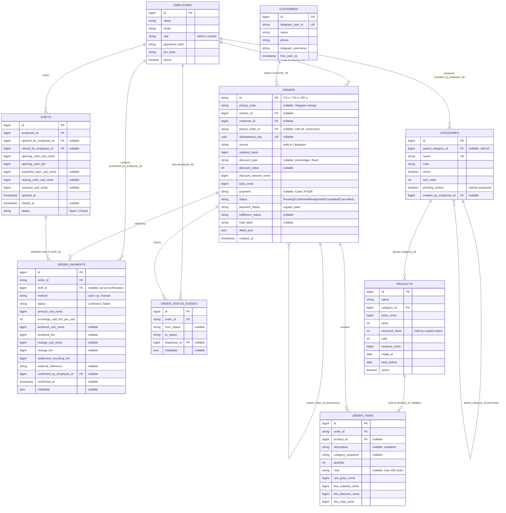

# Entity-Relationship Diagram

This is the real shape of the sales data in MySQL, pulled directly from the migration files (not simplified): who placed an order, what was in it, how it was paid for, and its full status history. Column names and types are copied from the migrations as written today.

Two tables exist purely to make the above race-safe and are intentionally left off the diagram since they hold no business data: `order_number_sequences` (one row per order-id prefix, row-locked to hand out the next number) and `store_shift_locks` (a single always-present row, row-locked so two "open shift" requests can never both succeed).
