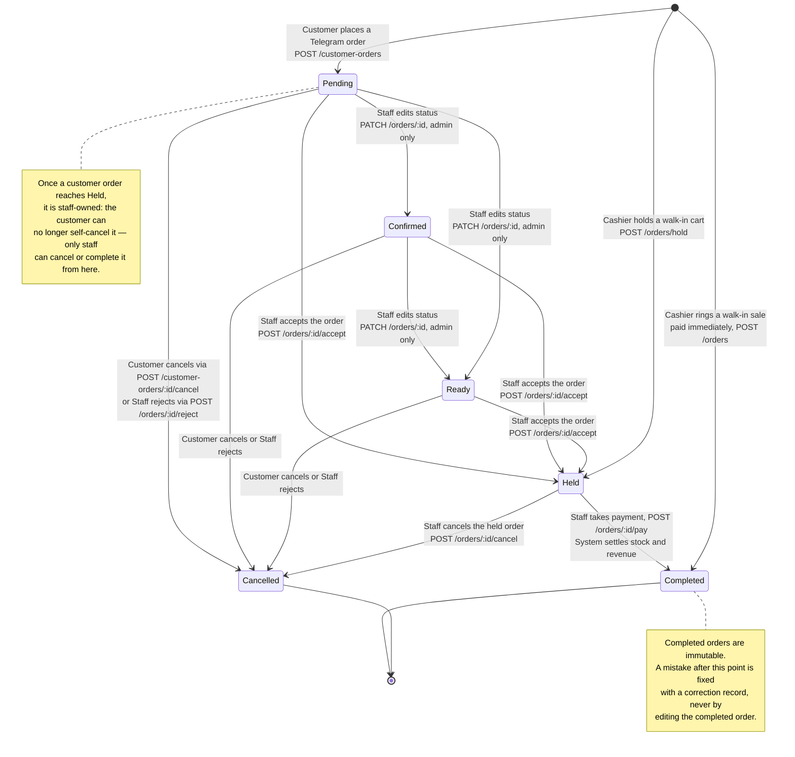

# Order Journey

This shows the two ways an order is born — a customer ordering through the Telegram Mini App, or a cashier ringing up a walk-in sale — and every status change each one can go through, exactly as the backend enforces it today. "Customer action", "Staff action" and "System action" label who or what actually causes each arrow.

