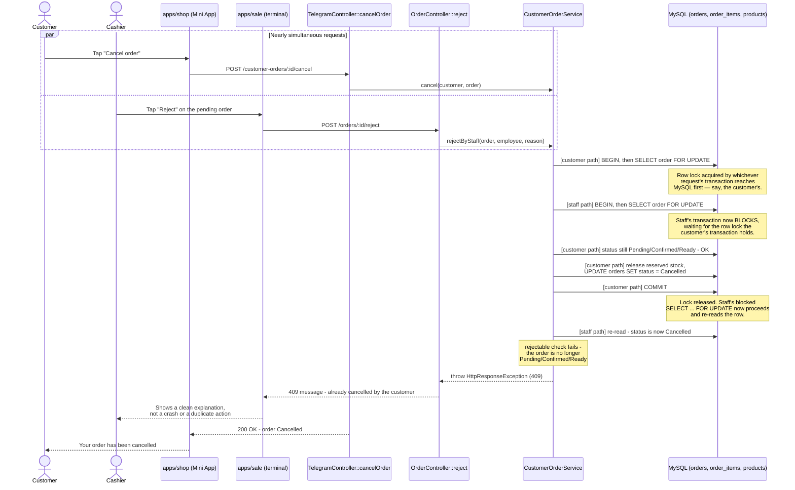

# The Two-Door Cancel Race

A not-yet-accepted Telegram order can be cancelled from two different doors at once: the customer tapping "Cancel" in the Mini App, and a cashier tapping "Reject" on the sale terminal after phoning the customer. Both doors lock the same order row and re-check its status only after acquiring that lock, so MySQL — not application luck — decides who gets there first. The loser never double-releases stock and never crashes; it gets a clean `409` explaining the order is already closed.

If the staff request had reached the lock first instead, the outcome is symmetric: the customer's later cancel attempt is the one that re-reads `Cancelled` and receives the `409`. Whichever request's `SELECT ... FOR UPDATE` commits its `Cancelled` update first always wins — the loser is decided by MySQL's row lock, not by which HTTP request happened to be handled first by PHP.
