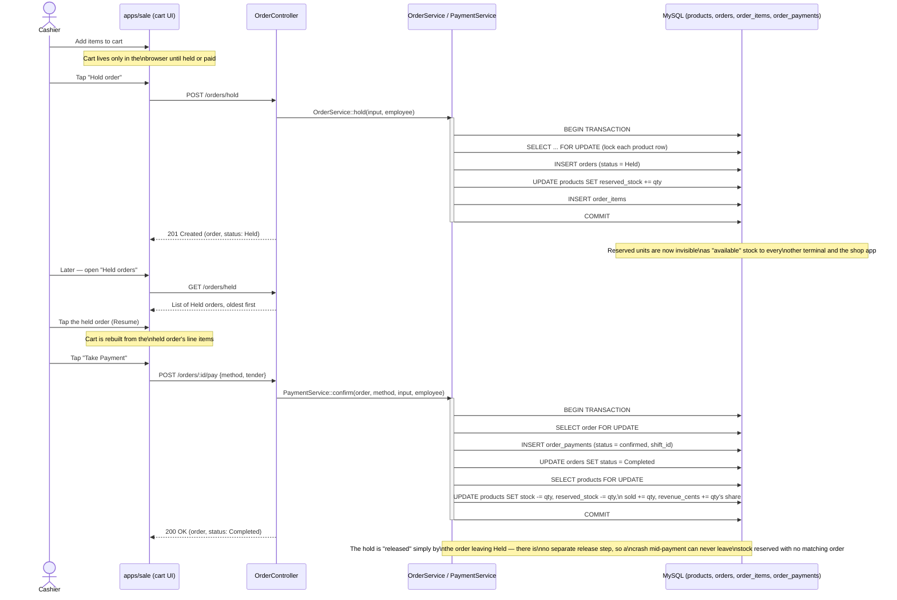

# Hold → Resume → Payment Sequence

This traces a cashier building a cart, parking it as a hold so the customer can pay later, resuming it, and taking payment. Stock is reserved the moment the hold is created — not left free for someone else to sell — and the hold is only cleared once payment is confirmed, inside the very same database transaction that records the sale.

