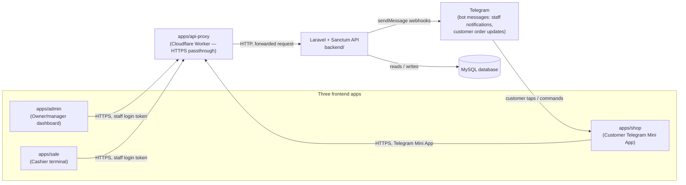

# System Architecture

Three separate apps — one for shop admins, one for cashiers at the counter, and one for customers on Telegram — all talk to the same backend, which is the only thing that ever touches the database. In production, requests pass through a small Cloudflare proxy that forwards HTTPS traffic to the backend server; locally, the frontends talk to the backend directly.

